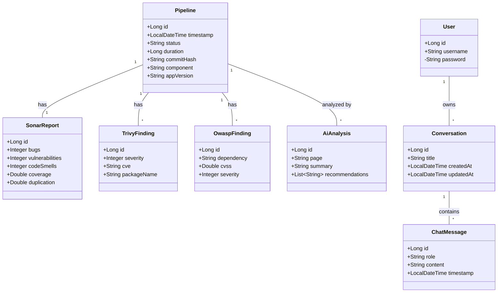

# Backend Class Diagram

This document provides a visualization of the core entities and their relationships within the DevOps Platform backend.

## Entity Relationships

- **Pipeline**: The central entity representing a CI/CD pipeline execution.
    - **SonarReport**: One-to-One relationship. Each pipeline has one quality report.
    - **TrivyFinding**: One-to-Many relationship. A pipeline can have multiple security findings from Trivy.
    - **OwaspFinding**: One-to-Many relationship. A pipeline can have multiple dependency findings from OWASP.
    - **AiAnalysis**: Many-to-One relationship. Multiple AI analyses can be associated with a single pipeline outcome.

- **DevOps Assistant (Chat)**:
    - **User**: Represents a system user.
    - **Conversation**: One-to-Many relationship with User. A user can have multiple chat conversations.
    - **ChatMessage**: One-to-Many relationship with Conversation. Each conversation consists of multiple messages (user/assistant).
