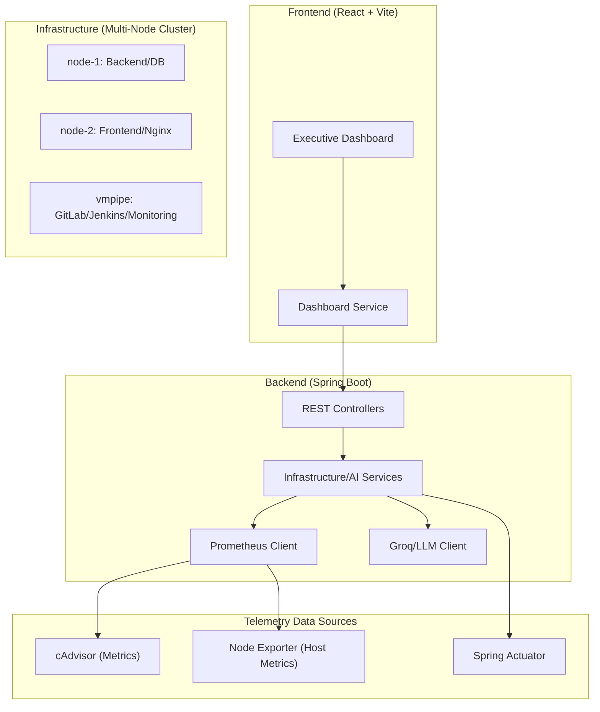

# Website Technical Details

This document provides detailed information on the technical architecture, data flow, and stack of the Executive DevOps Visibility Platform.

## 🏗 System Architecture

The platform is designed with a 3-layer structure for microservice observability.

## 🛠 Tech Stack

### Frontend
- **Framework**: React 18, Vite
- **Language**: TypeScript
- **Styling**: Tailwind CSS (Premium Dark Theme)
- **Visualization**: Recharts (Trends), Three.js (Future integration)
- **Icons**: Lucide React
- **State Management**: React Hooks (User-Defined Services)

### Backend
- **Framework**: Spring Boot 3.3.2
- **Security**: Spring Security, JWT
- **Database**: MySQL (JPA/Hibernate)
- **AI Engine**: Groq Cloud API (Llama 3.3 70B Model)
- **Client**: RestTemplate (Prometheus/Actuator API Integration)

### Infrastructure & Monitoring
- **Virtualization**: Docker & Docker Compose
- **Metric Collection**: Prometheus
- **Container Analysis**: Google cAdvisor
- **Host Monitoring**: Prometheus Node Exporter

## 📊 Key Features & Data Flow

### 1. Infrastructure Monitoring
- **Data Source**: Metrics collected via cAdvisor and Node Exporter are scraped by Prometheus.
- **Processing Logic**: `InfrastructureService` iterates through 3 nodes (node-1, node-2, vmpipe) to aggregate metrics.
- **Key Highlight**: Real-time container Uptime calculation and node-level resource usage (CPU, RAM, Disk) visualization.

### 2. Embedded AI Insights
- **Data Source**: Pipeline results, code quality scores, and security vulnerability data.
- **Processing Logic**: `AiAnalysisService` sends collected raw data along with context to the Groq LLM.
- **Result**: Generates real-time summaries and recommended actions for executives, with persistent caching.

### 3. Multi-Node Support
- **Registry**: `node-1` (192.168.126.131), `node-2` (192.168.126.132), `vmpipe` (192.168.126.130).
- **Aggregation**: Total container count, incident counts, and integrated health checks across the entire cluster.

## 🔒 Security & Governance
- All APIs support JWT-based authentication (Infrastructure endpoints are currently open for development convenience).
- Dashboard is configured to display actionable statistics while minimizing sensitive log exposure.
